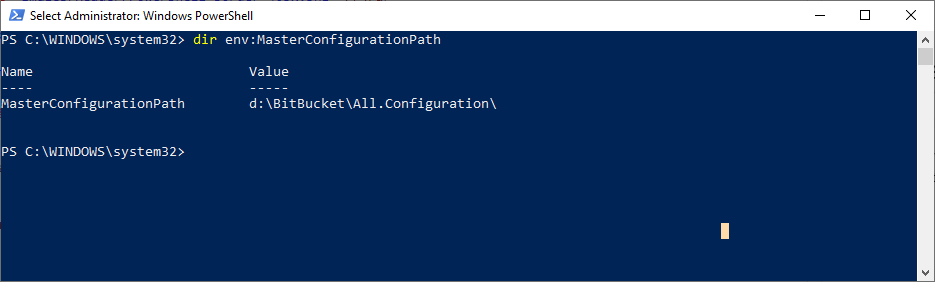
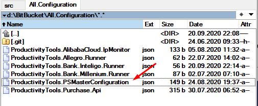
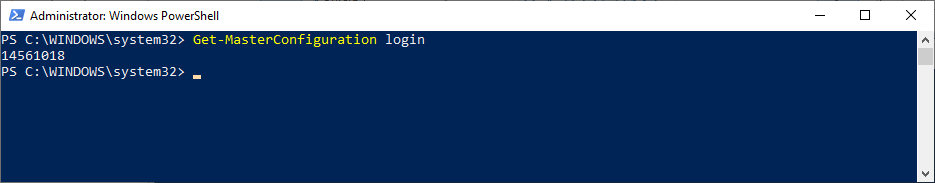
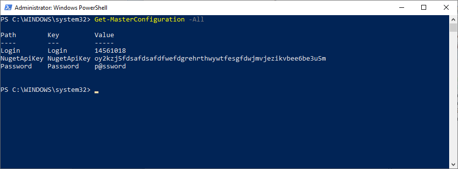

<!--Category:Powershell--> 
 <p align="right">
    <a href="https://www.powershellgallery.com/packages/ProductivityTools.PSMasterConfiguration/"></a>
    <a href="http://productivitytools.tech/powershell-master-configuration/"><a> 
    <a href="https://github.com/pwujczyk/ProductivityTools.PSMasterConfiguration"></a>
</p>
<p align="center">
    <a href="http://productivitytools.tech/">
        
    </a>
</p>

# PowerShell Master Configuration

The module allows to store configuration for the PowerShell in one single file.

<!--more-->

To use it you need to have set up an environment variable **MasterConfigurationPath** to the directory where you would like to store a configuration.



In the given directory you need to have a JSON configuration file.



Configuration should be in a simple JSON format with the configuration in the key-value pair.

```
{
  "Login": "14561018",

  "Password":"p@ssword",

  "NugetApiKey":"oy2kzj5fdsafdsafdfwefdgrehrthwywtfesgfdwjmvjezikvbee6be3u5m"
}
```

## Set-MasterConfiguration

To make setup easy, the module exposes the cmdlet which allows creating a directory and a file for configuration. Invoking ```Set-MasterConfiguration``` will:

- Create a **ProductivityTools.MasterConfiguration** directory in the Documents of the current user, or in the path provided to the cmdlet
- Create a file **ProductivityTools.PSMasterConfiguration.json** in the directory if not exists
- Set environment variables for a **Process** and for **Machine** with the a key **MasterConfigurationPath** which will target the directory described above

## Usage

To use the module call ```Get-MasterConfiguration``` with key.



If you would like to see all config values, use ```-All``` switch. The same effect you will achieve without any parameter. 
<!--og-image-->



Module is based on [MasterConfiguration](https://www.nuget.org/packages/ProductivityTools.MasterConfiguration/) NuGet package. For .NET application it is also needed to set up additional Environment Variable ```ASPNETCORE_ENVIRONMENT``` but in **PowerSher Master Configuration** this parameter is not mandatory as module force to use MasterConfiguration.


### Refresh the PowerShell session
If you would open the code, during Set-MasterConfiguration I set up two environment variables for Machine and for Process. This is a consequence of a way how PowerShell managing Environment Variables:
 - When the first instance of PowerShell instance is invoked, it creates list of Environment Variables and keeps them as Process. Restarting PowerShell doesn't refresh the variables.
 - If the module would setup only the **Machine** variable you will need to restart computer to make changes working.
 - If the module would setup only the **Process** variable after next restart variable would be cleared out.

